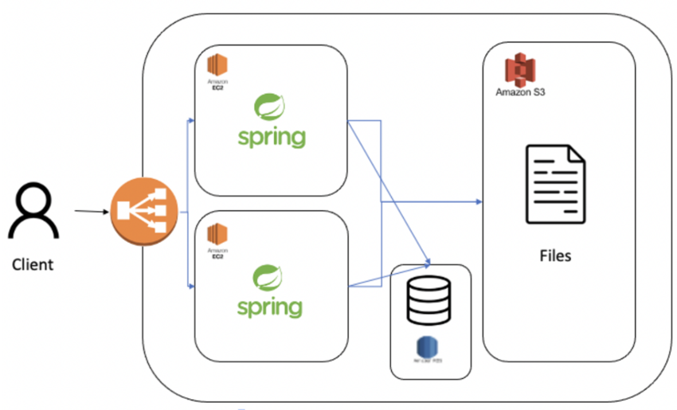

# D - Cloud 🗂

| Developer                          | Developer                             | Developer                          | 
|------------------------------------|---------------------------------------|------------------------------------|
| [고범석](https://github.com/qjatjr29) | [노강호](https://github.com/kangho-Noh) | [김환](https://github.com/hwankim123) |

## 프로젝트 개요

### 프로젝트 목적

- AWS 서비스와 웹 프레임워크를 이용해서 DropBox 같은 서비스를 만들어 보자

### 사용 기술

### 인프라

### 협업툴

### 아키텍처

### Branch Convention
브랜치는 다음과 같이 명명합니다.

- 기능 개발 목적의 브랜치
    - feature/개발분야
    